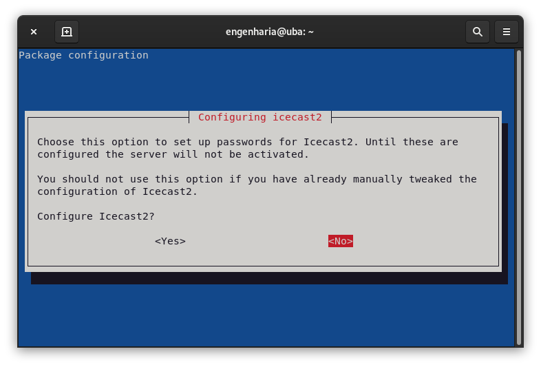
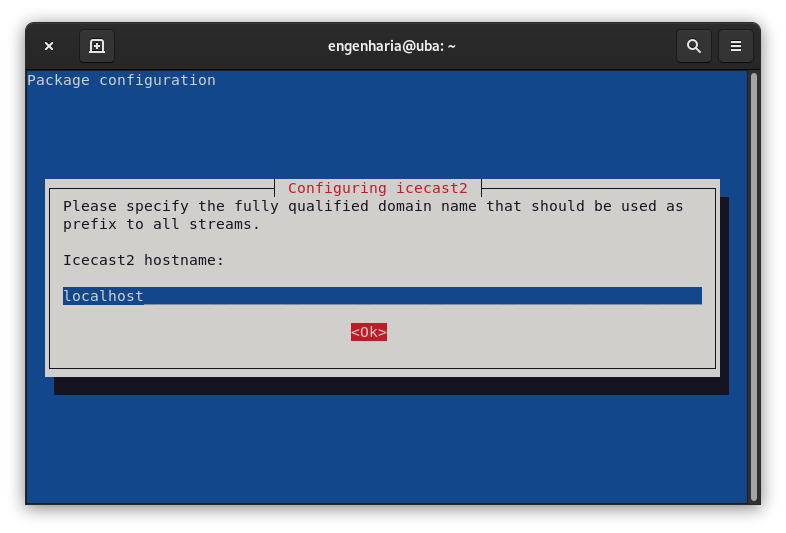
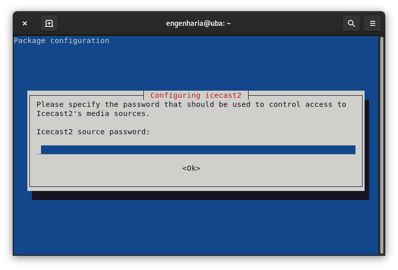
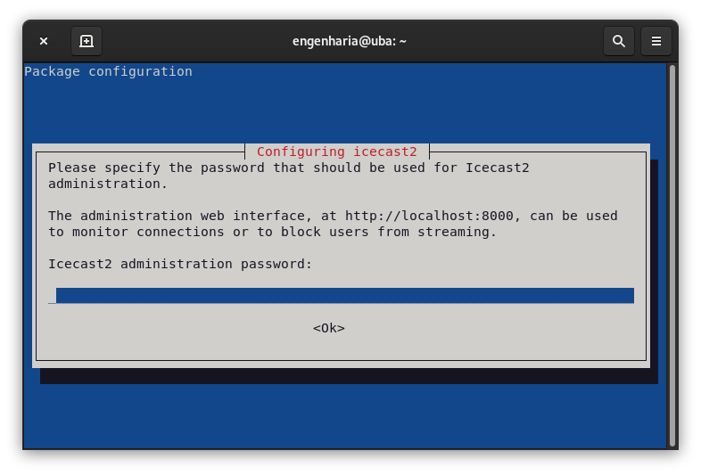
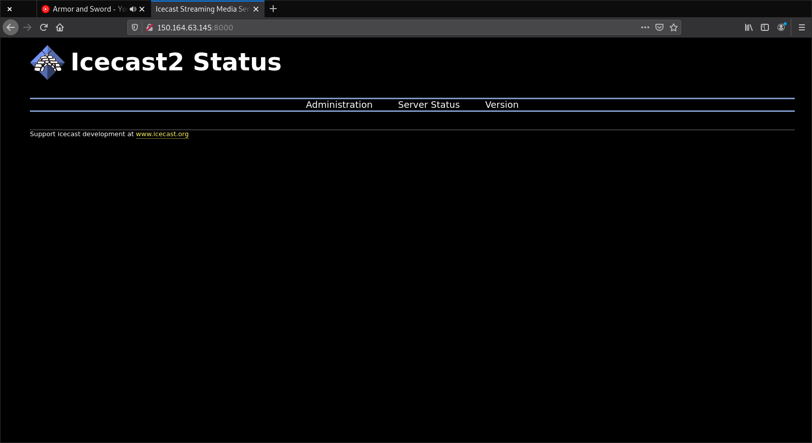

# Audio Stream Configuration with liquidsoap and Icecast2 (Rádio UFMG)

This tutorial aims to describe the steps to install and creates an audio stream for an webradio, using **icecast** and liquidsoap for linux *Ubuntu 18.04/Debiand 10*.

## Icecast2 

<p align="justify">

**Icecast** is a streaming media (audio/video) server which supports Ogg (Vorbis and Theora), Opus, WebM and MP3 streams. It is distributed under the GNU GPL, version 2 license and it can be used to create an Internet radio station and many other things. It is very versatile in that new formats can be added relatively easily and supports open standards for communication and interaction. The instructions described in this tutorial refers to **icecast2** version 2.4.4.

Each **icecast** server can house multiple streams, called mountpoints, that is a a unique name on your server identifying a particular stream like a filename. A listener can only listen to a single mountpoint at a time, thus, a single **icecast** server contain multiple broadcasts with different content, or the same broadcast with different bitrates or qualities, in a separate mountpoints.

</p>

### Install icecast2 on Ubuntu/Debian

On *Ubuntu/Debian*, terminal update the system packages, then install **icecast2** and its dependencies.
```bash
$sudo apt update -y && sudo apt dist-upgrade -y
$sudo apt install icecast2
```
During the installation process a terminal GUI with instructions will be opened, follow the instructions bellow.
1.  If is desired to configure the **icecast2** now, select `<Yes>` option, otherwise select `<No>`.
<p align="center">
    
</p>

2. Sets the domain name. Using `localhost`, means that the service will only stream on the localhost, i.e., refer to the host server domain name itself.
<p align="center">
    
</p>

3. sets the access control password to **icecast2**'s media sources. This password will be used later in the stream media generators.
<p align="center">
    
</p>

4. Sets the access control password to **icecast2**'s stream relays.
<p align="center">
    
</p>

5. Sets the **icecast2** web page administrator password. The administration web interface can monitor connection or block users from stream.
<p align="center">
    
</p>

The **incecast2** is automatically added to system services startup. The service status can be checked using `systemctl status` instruction, where the following result is expected:
```bash
$sudo systemctl status icecast2
● icecast2.service - LSB: Icecast2 streaming media server
    Loaded: loaded (/etc/init.d/icecast2; generated)
        Active: active (running) since Tue 2021-01-26 11:22:01 -03; 8min ago
        Docs: man:systemd-sysv-generator(8)
    Process: 33743 ExecStart=/etc/init.d/icecast2 start (code=exited, status=0/SUCCESS)
        Tasks: 4 (limit: 4650)
        Memory: 3.3M
        CPU: 143ms
        CGroup: /system.slice/icecast2.service
            └─33759 /usr/bin/icecast2 -b -c /etc/icecast2/icecast.xml
```
If the **icecast2** service has not been added at startup, the `systemctl enable` instruction should be applied to the `icecast2` escript found in the `/etc/defaults` folder.
```bash
$cd /etc/default/
$sudo sudo systemctl --now enable icecast2
$sudo systemctl status icecast2
```
Finally, the **icecast2** web page is available at:
>`http://host_ip_addres:8000`               

<p align="center">
    
</p>

### Configuration
<p align="justify">

After the instalation there is placed the configuration file `ìcecast2.xml` in `/etc/icecast2/` directory. In this file, it is possible to define a series of configurations as well as to change the parameters already defined in the installation process. 

The `<location>` and `<admin>` is the information that is shown on the info page of the Icecast web interface, only for display purposes.
```xml
    <location>Earth</location>
    <admin>localhost</admin>
```

The `<hostname>` defines the DNS name or IP address used for stream directory listings.
```xml
    <hostname>localhost</hostname>
```

In the `<authentication>`, the fields are:
- `<source-password>`: the stream sources clients log with with username `source` and their authentication password is defined here;
- `<relay-password>`: the stream relays log with username `relay` and its authentication password is defined in this field;
- `<admin-user>`: the admin username could be changed in this field ;
- `<admin-password>`: the web page administrator user log with username defined in `<admin-password>` and its password is defined here;       
```xml
   <authentication>
        <!-- Sources log in with username 'source' -->
        <source-password>source_password_here</source-password>
        <!-- Relays log in with username 'relay' -->
        <relay-password>relay_password_here</relay-password>
        <!-- Admin logs in with the username given below -->
        <admin-user>admin</admin-user>
        <admin-password>admin_password_here</admin-password>
    </authentication>
```
The `listen-socket` sets both port, bind address and if in use, the `shout-cast` mount point.
```xml
    <listen-socket>
        <port>8000</port>
        <!-- <bind-address>127.0.0.1</bind-address> -->
        <!-- <shoutcast-mount>/stream</shoutcast-mount> -->
    </listen-socket>
```

The `limits` section contains server level settings, usualy only `clients` and `sources` fields values need to be adjusted. 
- `<clients>`: sets the total number of concurrent clients supported by the server, where listeners are considered clients, but so are accesses to any static content and also any requests to gather stats.  
- `<sources>`: sets the maximum number of connected sources supported by the server. This includes active relays and source clients.

```xml
<limits>
    <clients>100</clients>
    <sources>2</sources>
    <queue-size>102400</queue-size>
    <client-timeout>30</client-timeout>
    <header-timeout>15</header-timeout>
    <source-timeout>10</source-timeout>
    <burst-on-connect>1</burst-on-connect>
    <burst-size>65536</burst-size>
</limits>
```

For more information about **icecast** stream server see its documentation [here](https://icecast.org/docs/icecast-trunk/).

</p>

## **Liquidsoap**
**Liquidsoap** is a general audio stream generator but, it is mainly intended for Internet radio.

<p align="justify">

### **Lisquidsoap** Install
Login to the computer that you intend to use as **liquidsoap** server and **Icecast** client, the ADC (or other digital input) must be connected to this server.

Install the latest system patches and also **alsa** tools, if it's not already installed:
```bash
$sudo apt update -y && sudo apt dist-upgrade -y
$sudo apt install alsa-utils -y 
```
Adds the system administrator user to the `audio` group, so its can run alsa applications without sudo at the next login. In the example bellow the user `radiola` is added to the `audio` group:
```bash
$sudo usermod -a -G audio radiola
```
Install **liquidsoap** and its plugins for alsa 
```bash
$sudo apt install liquidsoap  liquidsoap-plugin-alsa liquidsoap-plugin-flac liquidsoap-plugin-ogg -y
```
> **Pay Attention**: Since the `opus` is a proprietary audio format, in ubuntu 18.04 and later versions the opus plugin must be removed.
```bash
$sudo apt remove liquidsoap-plugin-opus -y
```
Add the `liquidsoap` user to `audio` goup and the system adminitrator user to `liquidsoap` group.
```bash
$sudo usermod -a -G audio liquidsoap 
$sudo usermod -a -G liquidsoap radiola
```
Changes the permissions in **liquidsoap** directories:
```bash
$sudo chmod 666 /etc/logrotate.d/liquidsoap
$sudo chmod 777 /var/log/liquidsoap
$sudo chmod a+x /run/liquidsoap
```
Creates the log file in the `/var/log/` folder and change owners of the log file,`/etc/logrotate.d/liquidsoap`, `/run/liquidsoap` and `var/log/liquidsoap` folders. In the example below it is created the log file named `radio.log`:

```bash
$sudo touch /var/log/liquidsoap/radio.log
$sudo chown liquidsoap:liquidsoap /etc/logrotate.d/liquidsoap
$sudo chown root:root /var/log/liquidsoap
$sudo chown liquidsoap:liquidsoap /var/run/liquidsoap
$sudo chown liquidsoap:liquidsoap /var/log/liquidsoap/radio.log
```
The **liquidsoap** service is automatically added to system start-up, but for this, the **liquidsoap** source file, or an alias for it, must be located within the `/etc/liquidsoap/` directory and give it execute permission for all users levels. In the example bellow it is created the source file `radio.liq`:

```bash
$sudo touch /etc/liquidsoap/radio.liq
$sudo chmod a+x /etc/liquidsoap/radio.liq
```
### Observations in **liquidsoap** source code

The reference to the log file permissions and path must be done at the begining of the source code, as follows:

```bash
set("log.file.path","/var/log/liquidsoap/radio.log")
set("log.file.perms",775)
set("log.unix_timestamps",true)
```
The audio input devices tag number is obtained through the instruction `arecord`. In the example below, the audio input device is identified as `card 1` and `device 0`

```bash
$sudo arecord -l
**** List of CAPTURE Hardware Devices ****
card 1: CODEC [USB Audio CODEC], device 0: USB Audio [USB Audio]
  Subdevices: 0/1
  Subdevice #0: subdevice #0
```
> **Obs**: For output devices should be used the `aplay` instruction.

Is a good programming practice assingn the audio input device to a variable, in order to reduce the code verbosity.

```bash
SOURCE = input.alsa(bufferize=true,fallible=false,device="hw:1,0")
```   

In the stream sources configurations, change the `host` and `password` fields accordling to the **icecast** server configuration. For more information about **liquidsoap** stream source see its documentation [here](https://www.liquidsoap.info/doc-1.4.0/).


</p>


# References
https://www.linuxuprising.com/2019/09/how-to-create-your-own-internet-radio.html
https://icecast.org/docs/icecast-trunk/


    

 


 
